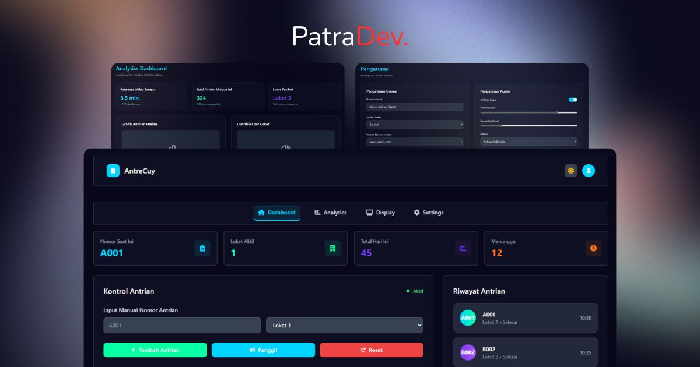

# PatraDev AntreCuy (Coming Soon)

**AntreCuy** adalah sistem antrean digital berbasis web yang ringan, fleksibel, dan mendukung integrasi IoT.  
Cocok untuk digunakan di klinik, kantor layanan publik, startup, dan skala UMKM.

## 🚀 Fitur Utama

- ✅ Real-time Queue Calling (dengan notifikasi suara dan teks)
- ✅ Responsive Dashboard (dibangun dengan Tailwind CSS)
- ✅ Browser-based Queue Display (LCD-style tanpa hardware khusus)
- ✅ REST API Fleksibel (bisa diintegrasikan dengan ESP32 / ESP8266)
- ✅ IoT Ready (dukungan untuk mikrokontroler)
- ✅ Panggilan antrean otomatis dengan suara
- ✅ Dukungan multi-ruang / loket

## 🧪 Fitur Lanjutan

- 🔄 Sinkronisasi multi-device
- 📱 Progressive Web App (PWA) support
- 📊 Riwayat antrean & statistik harian
- 👨‍⚕️ Role-based Access (admin, operator, pengunjung)
- 🔐 Mode Kios (pengunjung input mandiri)

## 💡 Contoh Use Case

- Klinik & Rumah Sakit
- Kantor Kelurahan / Pemerintah
- Layanan Customer Service
- Startup Produk / Warung Digital

## 🧑‍💻 Tim Pengembang

Proyek ini dikembangkan oleh **PatraDev**

## 🏷️ License

MIT License. Bebas digunakan & dikembangkan.

---

> Bismillah, semoga bermanfaat dan terus berkembang!  
> Jangan lupa kasih ⭐️ kalau suka 🙌
